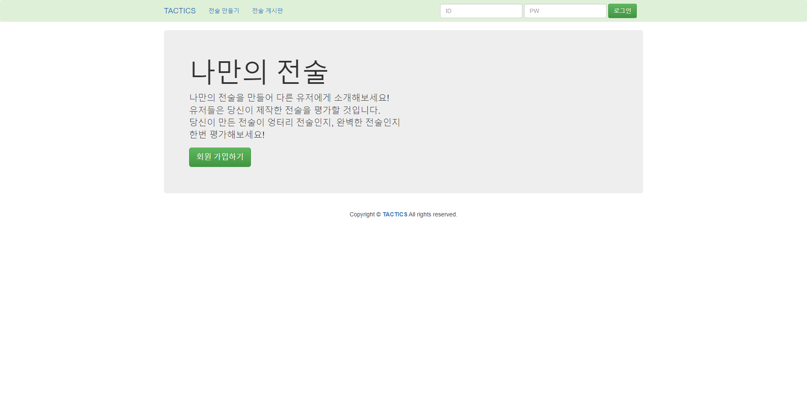
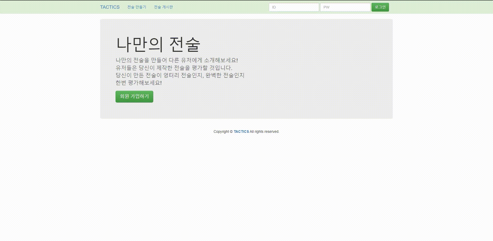
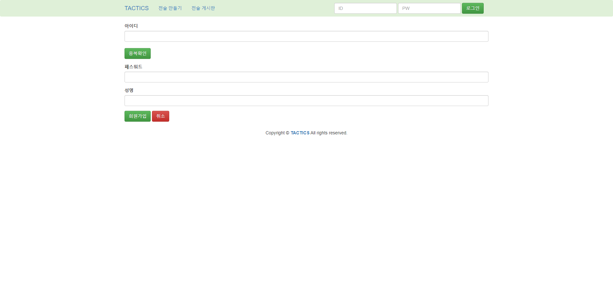
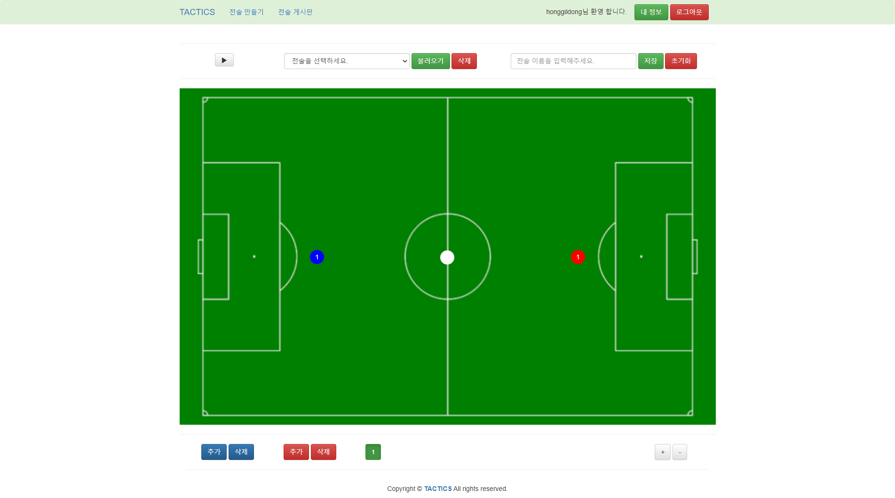
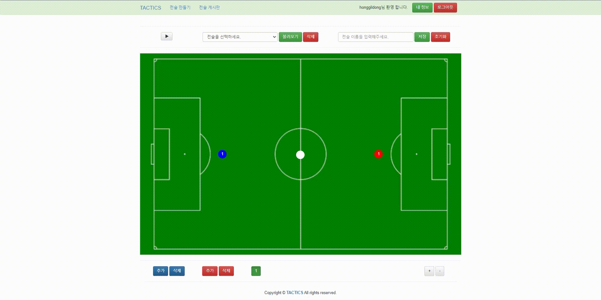
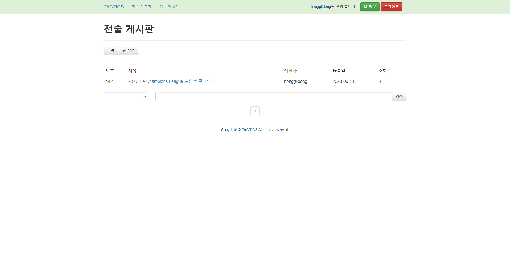
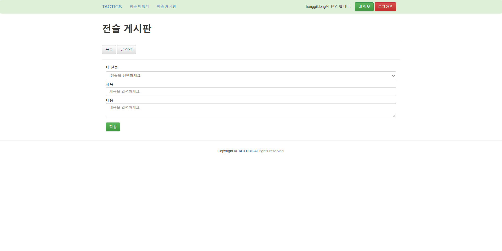
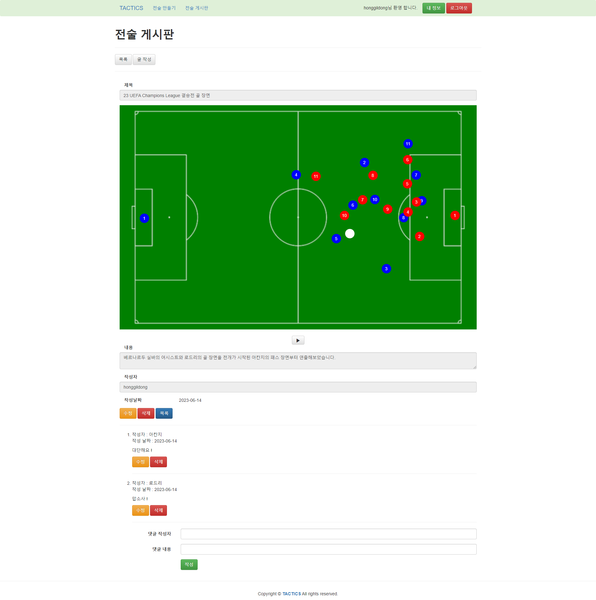

# project-tactics | 축구 전술 시뮬레이션 커뮤니티

축구 전술 시뮬레이션 커뮤니티의 사용 예제입니다.  

## 사용 예제
- 홈페이지
- 회원 가입
- 전술 만들기
- 전술 게시판

### 홈 페이지
최초 접속 시 홈 페이지입니다.  

  

상단의 헤더는 시뮬레이션 제작, 전술 게시판 로그인 기능을 포함합니다.  
배너의 회원 가입 버튼을 통해 회원 가입 페이지로 이동할 수 있습니다.  
 
 

로그인 시 홈 페이지의 모습은 다음과 같습니다.  

  

로그인 시 배너의 회원 가입 버튼은 전술 만들기 버튼으로 변화합니다.  
 
 

### 회원 가입

회원 가입 페이지입니다.  

  

아이디는 중복될 수 없으며, 이름과 비밀번호는 자유롭게 입력할 수 있습니다.  
 
 

회원 가입을 완료하게 되면, 홈 페이지로 이동하게 됩니다.  

  

 
 

### 전술 만들기
전술 만들기 페이지입니다.

  

 

상단의 메뉴에서 전술을 불러오거나 제작한 전술을 저장할 수 있고,   
불러온 전술을 삭제하거나, 진행 상황을 초기화 할 수 있습니다.  

하단의 메뉴에서 추가 삭제를 통해 선수를 추가 및 삭제를 할 수 있으며,  
왼쪽의 +, - 버튼을 통해 씬을 추가 및 삭제할 수 있습니다.  

씬 추가 시 각 선수의 이동 경로 파악을 위해 이전 씬의 장면이 불투명한 모습으로 고정됩니다.  

각 씬에 선수를 위치시켜 상단 좌측의 재생 버튼을 클릭하면,  
선수는 최초 1번 씬의 위치부터 마지막 씬의 위치까지 차례대로 이동합니다.  

우측 상단의 텍스트 박스에 전술 이름을 입력 후  
저장 버튼을 클릭하여 전술 시뮬레이션을 저장할 수 있습니다.  

좌측 상단의 리스트 박스를 통해 사용자가 저장한 전술을 불러올 수 있습니다.  
 
 

아래 영상은 전술 시뮬레이션을 만들고, 저장하여 불러오는 과정의 예시입니다.  

  

 
 

### 전술 게시판
전술 게시판 페이지입니다.  

  

상단의 메뉴바는 목록(현재 페이지), 글 작성 페이지로 이동하는 기능을 포함합니다.  
페이지 하단에서 제목, 내용, 작성자, 제목 + 내용으로 게시글을 검색할 수 있습니다.  
 
 

전술 게시글 작성 페이지 입니다.  

  

내 전술 아래 리스트 박스에서 내가 제작한 전술 시뮬레이션을 선택할 수 있습니다.  
제목과 내용을 작성하여 전술 게시판에 게시글을 작성할 수 있습니다.  
 
 

전술 게시글 페이지입니다.

  

모든 사용자는 작성자가 게시글 작성 시 선택했던 전술 시뮬레이션을 재생할 수 있습니다.  
또한 댓글을 통해 자유로운 토론 및 대화를 할 수 있습니다.
 
 
